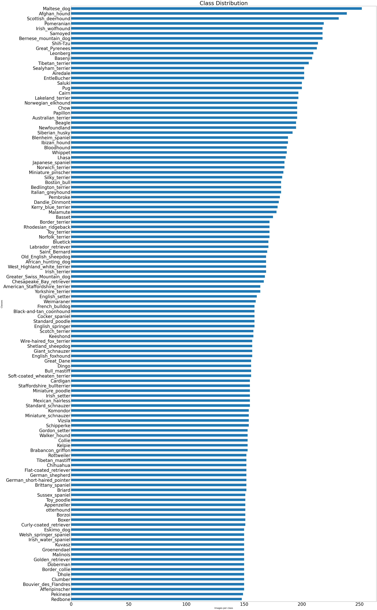
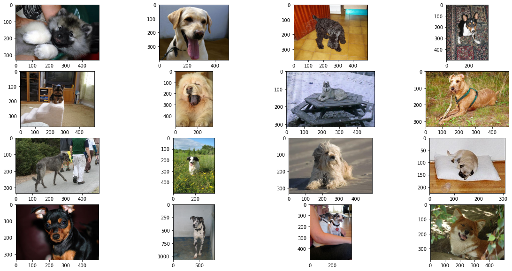
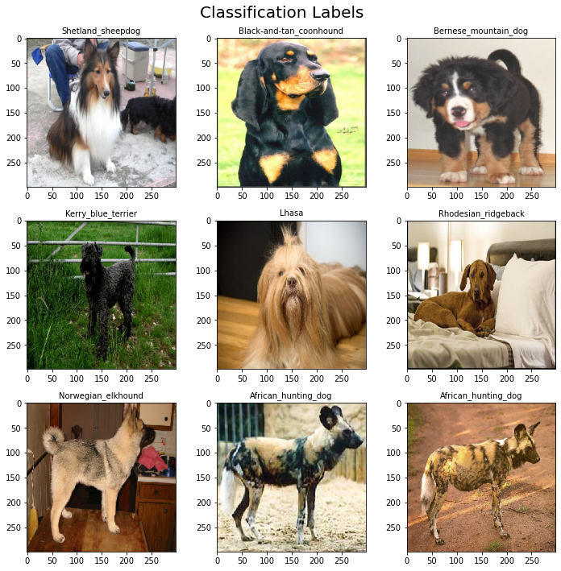
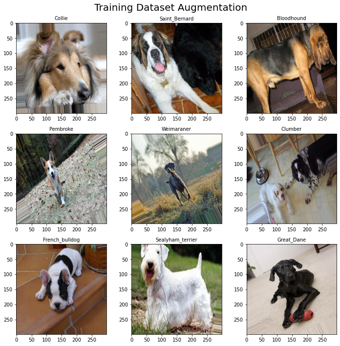
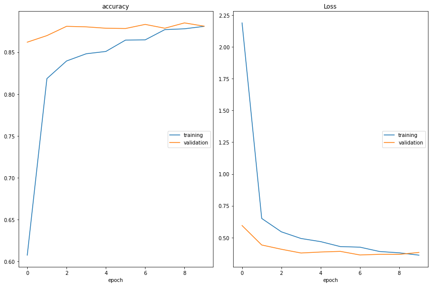
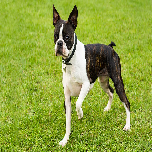

<font size="6"> **Dog Breed Classification**

The World Canine Organization currently recognizes 339 breeds of dogs. One might think that identifying dog breeds is a simple task, but some breeds look so similar that can become difficult for humans to classify.

For Example, in the Image below we can observe two different breeds that look almost the same. The image on the left is a Cardigan and the Image on the right is a Pembrooke Welsh Corgi.


As you can observe it is not that easy for humans to classify all dog breeds correctly. What about a computer, can a computer classify dog breeds better than a human? 

The objective of this project is to build a dog image classification model using transfer learning with at least 80% accuracy. In this project we will be using 2 pretrained models; VGG16 and InceptionV3. 


**Why is it important to build a dog image classification?**

Dog breed identification is essential for understanding individual breeds′ specifications, health concerns, and behaviours. Understanding this can be beneficial for dog owners, dog breeders, and pet insurance companies. For example, a pet insurance company might have different premiums based on common health conditions in specific breeds.

The knowledge of image classification can go beyond classifying dogs. We can also use this knowledge in the healthcare, transportation, manufacturing industry and more.


**Project Overview:** 

1.   The Data
2.   EDA
3.   Preprocessing and Image augmentation  
4.   Inception V3
5.   Model Evaluation
6.   Putting the Model to Practice
7.   Summary 
8.   Deploy the Model

# The Data

The Stanford Dogs dataset contains images of 120 breeds of dogs from around the world. This dataset has been built using images and annotation from ImageNet for the task of fine-grained image categorization. 

Contents of this dataset:

*   120 Dog Breed
*   Total Images: 20,580

The data can be obtain from Standford or Kraggle

 http://vision.stanford.edu/aditya86/ImageNetDogs/

 https://www.kaggle.com/datasets/jessicali9530/stanford-dogs-dataset


```python
"""
I'm going to import all the libraries that I might be using in this notebook, 
other imports might occur later in this notebooks""" 
import os
import cv2
import numpy as np
import matplotlib.pyplot as plt
from PIL import Image
from sklearn.model_selection import train_test_split
from glob import glob
import pandas as pd
from tensorflow import keras
from keras.layers import Conv2D,MaxPooling2D,Dense,Flatten,Dropout
from tensorflow.keras.layers import BatchNormalization
from tensorflow.keras.preprocessing.image import ImageDataGenerator
import matplotlib.image as mpimg
from skimage.transform import resize
import pandas as pd
from tensorflow.keras.utils import to_categorical, model_to_dot, plot_model


```

# EDA

In this section, will be load the dataset and do some basic EDA


```python
#load all dog images on train and test files
data_path =  os.listdir("images/Images")
dog_files = np.array(glob("images/Images/**/**"))
# print number of images in each dataset
print(f'Total number of categories in our dataset is {len(data_path)}')
print(f'Total Dog Images in our dataset is {len(dog_files)}')

```

    Total number of categories in our dataset is 120
    Total Dog Images in our dataset is 20580
    

We have a total of 20,580 images. Having all these images to train our model might look like a lot but the issue is the images will be distributed across our 120 classes, an average of 150 images per class. 

Another issue that we might encounter is class imbalance. Having our class imbalanced could pose a challenge for our model as most of the machine learning algorithms used for classification were designed around the assumption of an equal or approximate number of examples for each class.


Let's take a look at our dataset. 


```python
""" create panda dataframe containing all the images in our folders by breeds"""

X = []
y = []


for i in np.array(glob("images/Images/*/*")):
        
    X.append(i)
        
    y.append(i.split('images/Images\\')[1].split("\\")[0]) 

X = np.array(X)
y = np.array(y)

df = pd.DataFrame()
df['filename'] = X
df['breed'] = y

#check
df.head()

```


<div>
<style scoped>
    .dataframe tbody tr th:only-of-type {
        vertical-align: middle;
    }

    .dataframe tbody tr th {
        vertical-align: top;
    }

    .dataframe thead th {
        text-align: right;
    }
</style>
<table border="1" class="dataframe">
  <thead>
    <tr style="text-align: right;">
      <th></th>
      <th>filename</th>
      <th>breed</th>
    </tr>
  </thead>
  <tbody>
    <tr>
      <th>0</th>
      <td>images/Images\Affenpinscher\n02110627_10147.jpg</td>
      <td>Affenpinscher</td>
    </tr>
    <tr>
      <th>1</th>
      <td>images/Images\Affenpinscher\n02110627_10185.jpg</td>
      <td>Affenpinscher</td>
    </tr>
    <tr>
      <th>2</th>
      <td>images/Images\Affenpinscher\n02110627_10225.jpg</td>
      <td>Affenpinscher</td>
    </tr>
    <tr>
      <th>3</th>
      <td>images/Images\Affenpinscher\n02110627_10437.jpg</td>
      <td>Affenpinscher</td>
    </tr>
    <tr>
      <th>4</th>
      <td>images/Images\Affenpinscher\n02110627_10439.jpg</td>
      <td>Affenpinscher</td>
    </tr>
  </tbody>
</table>
</div>


```python
#do a quick check on the shape of Df
df.shape
```


    (20580, 2)


Let's plot the class distribution in our dataset.


```python
# create a plot to be able to visualized and determind any class imbalance 
ax=pd.value_counts(df['breed'],ascending=True).plot(kind='barh',
                                                       fontsize="40",
                                                       title="Class Distribution",
                                                       figsize=(50,100))
ax.set(xlabel="Images per class", ylabel="Classes")
ax.xaxis.label.set_size(20)
ax.yaxis.label.set_size(20)

ax.title.set_size(50)
```


    

    


From the plot above we can observe that there is not much difference between our classes, and have determined that our classes are balanced.

We can also observe that we don't have enough images for each class. In order to run a CNN from scratch we will been needing thousands of images for each class. In addition, having to train that much data with that many layers could take weeks. 
 

In the next section we are going to split our dataset into 60% train, 30% validation, and 10% test. 


```python
"""
I all ready run this code and if I run it again it would 
make the split again. If you want to run this code make sure to remove 
all the # from below """


#Split our dataset train/validation/test
#import splitfolders 
#input_folder = "images/Images"
#output = "images/dog_images1" 

#splitfolders.ratio(input_folder, output=output, seed=42, ratio=(.6, .3, .1)) 
```


    '\nI all ready run this code and if I run it again it would \nmake the split again. If you want to run this code make sure to remove \nall the # from below '


Let's Load our new files and make sure everything is in order. 


```python

""" 
In the cell above we split our data in to 
train, validation, and test. the code below is just to
make sure that it works"""

#take a look at our directory

train_path = os.listdir("images/dog_images1/train")
val_path = os.listdir("images/dog_images1/val")
test_path = os.listdir("images/dog_images1/test")


# load filenames dog images on train and test files
dog_files = np.array(glob("images/dog_images1/*/*/*"))
#load number image in train/val/test
train_image_total= (len(np.array(glob("images/dog_images1/train/*/*"))))
val_image_total= (len(np.array(glob("images/dog_images1/val/*/*"))))
test_image_total= (len(np.array(glob("images/dog_images1/test/*/*"))))


# print number of images in each dataset
print(f'Total Dog Images: {len(dog_files)}')


#Take a look at the images in our train, validation, test folder
print(f"The training dataset contains {len(train_path)} categories and {train_image_total} images")
print(f"The validation dataset contains {len(train_path)} categories and {val_image_total} images")
print(f"The test dataset contains {len(train_path)} categories and {test_image_total} images")


    

    
```

    Total Dog Images: 20580
    The training dataset contains 120 categories and 12307 images
    The validation dataset contains 120 categories and 6122 images
    The test dataset contains 120 categories and 2151 images
    

# Preprocessing and Image Augmentation

First, the photograph needs to loaded and reshaped to a 224×224 or 299x299 square and the pixel values scaled in the way expected by the model.

Visualized a few examples


```python
# load Files
dog_files = np.array(glob("images/dog_images1/*/*/*"))

#Visualize some training examples

def displayImage(img_path,ax):
  image = cv2.imread(img_path)
  ax.imshow(cv2.cvtColor(image,cv2.COLOR_BGR2RGB))

sample = list(np.random.choice(dog_files.shape[0],16))
fig = plt.figure(figsize=(20,10))
for index,im in enumerate(sample):
  ax = fig.add_subplot(4,4,index+1)
  #ax.set_title(dog_files.shape[0],16)
  displayImage(dog_files[im],ax)
  
```


    

    


As you can observe from the plot above, our images do not have the same shape. For our model, we need to resize them to the same shape. We used the common practice to reshape them as squares. We also need to normalize our dataset by dividing all the pixel values by 255. The new pixels values will be in the range [0,1].

In addition, we need to do some image augmentation to our training dataset. The idea behind image augmentation is that we follow a set process of taking in existing images from our training dataset and applying some image transformation operations to them, such as rotation, shearing, translation, and zooming, to produce new, altered versions of existing images. Due to these random transformations, we don’t get the same images each time, and we will use ImageDataGenerators to feed in these new images to our model during training.


```python
#load number image in train/val/test
train= "images/dog_images1/train"
validation= "images/dog_images1/val"
test= "images/dog_images1/test"

# Specify the dimensions we want our images to be preprocessed to
# (This will allow us to images of different resolutions)
height = 299 
width = 299 
channels = 3

# Create training image data generator.
train_datagen = ImageDataGenerator(rescale=1./255,  
                                   rotation_range = 30,
                                   shear_range=0.2,
                                   zoom_range=0.2,
                                   horizontal_flip=True)

# Create validation image data generator.
# Only apply rescaling to our validation data.
validation_datagen = ImageDataGenerator(rescale=1./255)

# Finaly we specify where the images should be loaded from
# as well as some additional attributes:
train_generator=train_datagen.flow_from_directory(train,
                                                 target_size=(height,width),
                                                 color_mode='rgb',
                                                 batch_size=32,
                                                 class_mode='categorical')

validation_generator=validation_datagen.flow_from_directory(validation,
                                                 target_size=(height,width),
                                                 color_mode='rgb',
                                                 batch_size=32,
                                                 class_mode='categorical')


"""I won't be running the test_generation at the moment, I just wanted to be able to have
the validation generator, train data generator and test generator in the same cell """

#test_datagen = ImageDataGenerator(rescale=1./255)
#test_generator = test_datagen.flow_from_directory(test,
                                                  #target_size=(height,width),
                                                  #color_mode='rgb',
                                                  #batch_size=2151,
                                                  #class_mode='categorical')"""
```

    Found 12307 images belonging to 120 classes.
    Found 6122 images belonging to 120 classes.
    


    "I won't be running the test_generation at the moment, I just wanted to be able to have\nthe validation generator, train data generator and test generator in the same cell"


```python
""""This will flip our map directory, this way we can match it to our labels
our class dictionary"""
label_map = validation_generator.class_indices
#invert dictionary
label_map = dict((v,k) for k,v in label_map.items())
# check
label_map


```


    {0: 'Affenpinscher',
     1: 'Afghan_hound',
     2: 'African_hunting_dog',
     3: 'Airedale',
     4: 'American_Staffordshire_terrier',
     5: 'Appenzeller',
     6: 'Australian_terrier',
     7: 'Basenji',
     8: 'Basset',
     9: 'Beagle',
     10: 'Bedlington_terrier',
     11: 'Bernese_mountain_dog',
     12: 'Black-and-tan_coonhound',
     13: 'Blenheim_spaniel',
     14: 'Bloodhound',
     15: 'Bluetick',
     16: 'Border_collie',
     17: 'Border_terrier',
     18: 'Borzoi',
     19: 'Boston_bull',
     20: 'Bouvier_des_Flandres',
     21: 'Boxer',
     22: 'Brabancon_griffon',
     23: 'Briard',
     24: 'Brittany_spaniel',
     25: 'Bull_mastiff',
     26: 'Cairn',
     27: 'Cardigan',
     28: 'Chesapeake_Bay_retriever',
     29: 'Chihuahua',
     30: 'Chow',
     31: 'Clumber',
     32: 'Cocker_spaniel',
     33: 'Collie',
     34: 'Curly-coated_retriever',
     35: 'Dandie_Dinmont',
     36: 'Dhole',
     37: 'Dingo',
     38: 'Doberman',
     39: 'English_foxhound',
     40: 'English_setter',
     41: 'English_springer',
     42: 'EntleBucher',
     43: 'Eskimo_dog',
     44: 'Flat-coated_retriever',
     45: 'French_bulldog',
     46: 'German_shepherd',
     47: 'German_short-haired_pointer',
     48: 'Giant_schnauzer',
     49: 'Golden_retriever',
     50: 'Gordon_setter',
     51: 'Great_Dane',
     52: 'Great_Pyrenees',
     53: 'Greater_Swiss_Mountain_dog',
     54: 'Groenendael',
     55: 'Ibizan_hound',
     56: 'Irish_setter',
     57: 'Irish_terrier',
     58: 'Irish_water_spaniel',
     59: 'Irish_wolfhound',
     60: 'Italian_greyhound',
     61: 'Japanese_spaniel',
     62: 'Keeshond',
     63: 'Kelpie',
     64: 'Kerry_blue_terrier',
     65: 'Komondor',
     66: 'Kuvasz',
     67: 'Labrador_retriever',
     68: 'Lakeland_terrier',
     69: 'Leonberg',
     70: 'Lhasa',
     71: 'Malamute',
     72: 'Malinois',
     73: 'Maltese_dog',
     74: 'Mexican_hairless',
     75: 'Miniature_pinscher',
     76: 'Miniature_poodle',
     77: 'Miniature_schnauzer',
     78: 'Newfoundland',
     79: 'Norfolk_terrier',
     80: 'Norwegian_elkhound',
     81: 'Norwich_terrier',
     82: 'Old_English_sheepdog',
     83: 'Papillon',
     84: 'Pekinese',
     85: 'Pembroke',
     86: 'Pomeranian',
     87: 'Pug',
     88: 'Redbone',
     89: 'Rhodesian_ridgeback',
     90: 'Rottweiler',
     91: 'Saint_Bernard',
     92: 'Saluki',
     93: 'Samoyed',
     94: 'Schipperke',
     95: 'Scotch_terrier',
     96: 'Scottish_deerhound',
     97: 'Sealyham_terrier',
     98: 'Shetland_sheepdog',
     99: 'Shih-Tzu',
     100: 'Siberian_husky',
     101: 'Silky_terrier',
     102: 'Soft-coated_wheaten_terrier',
     103: 'Staffordshire_bullterrier',
     104: 'Standard_poodle',
     105: 'Standard_schnauzer',
     106: 'Sussex_spaniel',
     107: 'Tibetan_mastiff',
     108: 'Tibetan_terrier',
     109: 'Toy_poodle',
     110: 'Toy_terrier',
     111: 'Vizsla',
     112: 'Walker_hound',
     113: 'Weimaraner',
     114: 'Welsh_springer_spaniel',
     115: 'West_Highland_white_terrier',
     116: 'Whippet',
     117: 'Wire-haired_fox_terrier',
     118: 'Yorkshire_terrier',
     119: 'otterhound'}


**Let's plot some of our classes from the validation set**


```python
# Grab a batch of images from our validation generator: 

x, y = validation_generator.next() 

# Our images labels are one-hot encoded, lets 
# convert them to ordinal encoding
labels = np.argmax(y, axis=1)

#this determines the number of colunms and rows.
fig, ax = plt.subplots(nrows=3, ncols=3,  figsize=(10, 10))
ax = ax.flatten()

#Let's determine how many image we want to display
for i in range(9):
    index = np.argmax(labels==i) 
    ax[i].imshow(x[i])
    
    # Set the title of the subplot
    ax[i].set_title(label_map.get(labels[i]), size=10)

 
    

fig.suptitle("Classification Labels", size = 20)

 

fig.tight_layout()

plt.show()
```


    

    


**Plotting some images for the training set**


```python
# Grab a batch of images from our validation generator: 

x, y = train_generator.next() 

# Our images labels are one-hot encoded, lets 
# convert them to ordinal encoding
labels = np.argmax(y, axis=1)

fig, ax = plt.subplots(nrows=3, ncols=3,  figsize=(10, 10))
ax = ax.flatten()

for i in range(9):
    index = np.argmax(labels==i) 
    ax[i].imshow(x[i])
    
    # Set the title of the subplot
    ax[i].set_title(label_map.get(labels[i]), size=10)

 
    

fig.suptitle("Training Dataset Augmentation", size = 20)

 

fig.tight_layout()

plt.show()
```


    

    


On the Plot above, we can observe how some images are slightly tilted, distorted and or flipped, but are all (299x299).  This is the effect of doing image augmentation on our training dataset. Our data is now ready to be input into our model. 

**Now that we have done the Eda and Image preprocessing we are ready to start building our model.**

# Inception V3

When using transfer learning it is important to have basic knowledge of convolutional neural networks (CNN) since image classification calls for using this algorithm.

CNN are a class of Deep Neural Networks that specializes in applications of image & video recognition. CNN is mainly used in image analysis tasks like image recognition, object detection, segmentation and image classification.

There are three types of layers that make up the CNN which are the convolutional layers, pooling layers, and fully connected layers. When these layers are stacked, a CNN architecture will be formed. Running a convolutional neural network from scratch will require a lot of data and computational power. Training this model from scratch with a lot of layers could take days or weeks to train. For this reason, it is better to use transfer learning.

Transfer Learning is when he knowledge of an already trained machine learning model is transferred to a similar problem. For example, someone trained an image classifier to identify different types of animals. We can use the model’s training knowledge to identify different types of breeds.


**Strategy**

- The first step is to get the pre-trained model in this case inception V3. We will instantiate the base model using Inception V3 and Imagenet as Weights
- Freezing the layers from the model is vital. we do not want the weights in those layers to be re-initialized.
- Add new trainable layers that will turn old features in to our predictions
- Train the model


```python
from keras.models import Model
from keras.optimizers import Adam
from keras.layers import GlobalAveragePooling2D
from keras.layers import Dense
from keras.applications.inception_v3 import InceptionV3
from keras.utils.np_utils import to_categorical

# Get the InceptionV3 model so we can do transfer learning
base_inception = InceptionV3(weights='imagenet', include_top=False, 
                             input_shape=(299, 299, 3))
                             
# Add new trainable layers
out = base_inception.output
out = GlobalAveragePooling2D()(out)
out = Dense(512, activation='relu')(out)
out = Dense(512, activation='relu')(out)
total_classes = 120
predictions = Dense(total_classes, activation='softmax')(out)

model = Model(inputs=base_inception.input, outputs=predictions)

# freeze layers
for layer in base_inception.layers:
    layer.trainable = False
optimizer =Adam(learning_rate=0.0001)
# Compile 
model.compile(optimizer = optimizer, loss='categorical_crossentropy', metrics=['accuracy']) 
model.summary()
```

    Model: "model"
    __________________________________________________________________________________________________
     Layer (type)                   Output Shape         Param #     Connected to                     
    ==================================================================================================
     input_1 (InputLayer)           [(None, 299, 299, 3  0           []                               
                                    )]                                                                
                                                                                                      
     conv2d (Conv2D)                (None, 149, 149, 32  864         ['input_1[0][0]']                
                                    )                                                                 
                                                                                                      
     batch_normalization (BatchNorm  (None, 149, 149, 32  96         ['conv2d[0][0]']                 
     alization)                     )                                                                 
                                                                                                      
     activation (Activation)        (None, 149, 149, 32  0           ['batch_normalization[0][0]']    
                                    )                                                                 
                                                                                                      
     conv2d_1 (Conv2D)              (None, 147, 147, 32  9216        ['activation[0][0]']             
                                    )                                                                 
                                                                                                      
     batch_normalization_1 (BatchNo  (None, 147, 147, 32  96         ['conv2d_1[0][0]']               
     rmalization)                   )                                                                 
                                                                                                      
     activation_1 (Activation)      (None, 147, 147, 32  0           ['batch_normalization_1[0][0]']  
                                    )                                                                 
                                                                                                      
     conv2d_2 (Conv2D)              (None, 147, 147, 64  18432       ['activation_1[0][0]']           
                                    )                                                                 
                                                                                                      
     batch_normalization_2 (BatchNo  (None, 147, 147, 64  192        ['conv2d_2[0][0]']               
     rmalization)                   )                                                                 
                                                                                                      
     activation_2 (Activation)      (None, 147, 147, 64  0           ['batch_normalization_2[0][0]']  
                                    )                                                                 
                                                                                                      
     max_pooling2d (MaxPooling2D)   (None, 73, 73, 64)   0           ['activation_2[0][0]']           
                                                                                                      
     conv2d_3 (Conv2D)              (None, 73, 73, 80)   5120        ['max_pooling2d[0][0]']          
                                                                                                      
     batch_normalization_3 (BatchNo  (None, 73, 73, 80)  240         ['conv2d_3[0][0]']               
     rmalization)                                                                                     
                                                                                                      
     activation_3 (Activation)      (None, 73, 73, 80)   0           ['batch_normalization_3[0][0]']  
                                                                                                      
     conv2d_4 (Conv2D)              (None, 71, 71, 192)  138240      ['activation_3[0][0]']           
                                                                                                      
     batch_normalization_4 (BatchNo  (None, 71, 71, 192)  576        ['conv2d_4[0][0]']               
     rmalization)                                                                                     
                                                                                                      
     activation_4 (Activation)      (None, 71, 71, 192)  0           ['batch_normalization_4[0][0]']  
                                                                                                      
     max_pooling2d_1 (MaxPooling2D)  (None, 35, 35, 192)  0          ['activation_4[0][0]']           
                                                                                                      
     conv2d_8 (Conv2D)              (None, 35, 35, 64)   12288       ['max_pooling2d_1[0][0]']        
                                                                                                      
     batch_normalization_8 (BatchNo  (None, 35, 35, 64)  192         ['conv2d_8[0][0]']               
     rmalization)                                                                                     
                                                                                                      
     activation_8 (Activation)      (None, 35, 35, 64)   0           ['batch_normalization_8[0][0]']  
                                                                                                      
     conv2d_6 (Conv2D)              (None, 35, 35, 48)   9216        ['max_pooling2d_1[0][0]']        
                                                                                                      
     conv2d_9 (Conv2D)              (None, 35, 35, 96)   55296       ['activation_8[0][0]']           
                                                                                                      
     batch_normalization_6 (BatchNo  (None, 35, 35, 48)  144         ['conv2d_6[0][0]']               
     rmalization)                                                                                     
                                                                                                      
     batch_normalization_9 (BatchNo  (None, 35, 35, 96)  288         ['conv2d_9[0][0]']               
     rmalization)                                                                                     
                                                                                                      
     activation_6 (Activation)      (None, 35, 35, 48)   0           ['batch_normalization_6[0][0]']  
                                                                                                      
     activation_9 (Activation)      (None, 35, 35, 96)   0           ['batch_normalization_9[0][0]']  
                                                                                                      
     average_pooling2d (AveragePool  (None, 35, 35, 192)  0          ['max_pooling2d_1[0][0]']        
     ing2D)                                                                                           
                                                                                                      
     conv2d_5 (Conv2D)              (None, 35, 35, 64)   12288       ['max_pooling2d_1[0][0]']        
                                                                                                      
     conv2d_7 (Conv2D)              (None, 35, 35, 64)   76800       ['activation_6[0][0]']           
                                                                                                      
     conv2d_10 (Conv2D)             (None, 35, 35, 96)   82944       ['activation_9[0][0]']           
                                                                                                      
     conv2d_11 (Conv2D)             (None, 35, 35, 32)   6144        ['average_pooling2d[0][0]']      
                                                                                                      
     batch_normalization_5 (BatchNo  (None, 35, 35, 64)  192         ['conv2d_5[0][0]']               
     rmalization)                                                                                     
                                                                                                      
     batch_normalization_7 (BatchNo  (None, 35, 35, 64)  192         ['conv2d_7[0][0]']               
     rmalization)                                                                                     
                                                                                                      
     batch_normalization_10 (BatchN  (None, 35, 35, 96)  288         ['conv2d_10[0][0]']              
     ormalization)                                                                                    
                                                                                                      
     batch_normalization_11 (BatchN  (None, 35, 35, 32)  96          ['conv2d_11[0][0]']              
     ormalization)                                                                                    
                                                                                                      
     activation_5 (Activation)      (None, 35, 35, 64)   0           ['batch_normalization_5[0][0]']  
                                                                                                      
     activation_7 (Activation)      (None, 35, 35, 64)   0           ['batch_normalization_7[0][0]']  
                                                                                                      
     activation_10 (Activation)     (None, 35, 35, 96)   0           ['batch_normalization_10[0][0]'] 
                                                                                                      
     activation_11 (Activation)     (None, 35, 35, 32)   0           ['batch_normalization_11[0][0]'] 
                                                                                                      
     mixed0 (Concatenate)           (None, 35, 35, 256)  0           ['activation_5[0][0]',           
                                                                      'activation_7[0][0]',           
                                                                      'activation_10[0][0]',          
                                                                      'activation_11[0][0]']          
                                                                                                      
     conv2d_15 (Conv2D)             (None, 35, 35, 64)   16384       ['mixed0[0][0]']                 
                                                                                                      
     batch_normalization_15 (BatchN  (None, 35, 35, 64)  192         ['conv2d_15[0][0]']              
     ormalization)                                                                                    
                                                                                                      
     activation_15 (Activation)     (None, 35, 35, 64)   0           ['batch_normalization_15[0][0]'] 
                                                                                                      
     conv2d_13 (Conv2D)             (None, 35, 35, 48)   12288       ['mixed0[0][0]']                 
                                                                                                      
     conv2d_16 (Conv2D)             (None, 35, 35, 96)   55296       ['activation_15[0][0]']          
                                                                                                      
     batch_normalization_13 (BatchN  (None, 35, 35, 48)  144         ['conv2d_13[0][0]']              
     ormalization)                                                                                    
                                                                                                      
     batch_normalization_16 (BatchN  (None, 35, 35, 96)  288         ['conv2d_16[0][0]']              
     ormalization)                                                                                    
                                                                                                      
     activation_13 (Activation)     (None, 35, 35, 48)   0           ['batch_normalization_13[0][0]'] 
                                                                                                      
     activation_16 (Activation)     (None, 35, 35, 96)   0           ['batch_normalization_16[0][0]'] 
                                                                                                      
     average_pooling2d_1 (AveragePo  (None, 35, 35, 256)  0          ['mixed0[0][0]']                 
     oling2D)                                                                                         
                                                                                                      
     conv2d_12 (Conv2D)             (None, 35, 35, 64)   16384       ['mixed0[0][0]']                 
                                                                                                      
     conv2d_14 (Conv2D)             (None, 35, 35, 64)   76800       ['activation_13[0][0]']          
                                                                                                      
     conv2d_17 (Conv2D)             (None, 35, 35, 96)   82944       ['activation_16[0][0]']          
                                                                                                      
     conv2d_18 (Conv2D)             (None, 35, 35, 64)   16384       ['average_pooling2d_1[0][0]']    
                                                                                                      
     batch_normalization_12 (BatchN  (None, 35, 35, 64)  192         ['conv2d_12[0][0]']              
     ormalization)                                                                                    
                                                                                                      
     batch_normalization_14 (BatchN  (None, 35, 35, 64)  192         ['conv2d_14[0][0]']              
     ormalization)                                                                                    
                                                                                                      
     batch_normalization_17 (BatchN  (None, 35, 35, 96)  288         ['conv2d_17[0][0]']              
     ormalization)                                                                                    
                                                                                                      
     batch_normalization_18 (BatchN  (None, 35, 35, 64)  192         ['conv2d_18[0][0]']              
     ormalization)                                                                                    
                                                                                                      
     activation_12 (Activation)     (None, 35, 35, 64)   0           ['batch_normalization_12[0][0]'] 
                                                                                                      
     activation_14 (Activation)     (None, 35, 35, 64)   0           ['batch_normalization_14[0][0]'] 
                                                                                                      
     activation_17 (Activation)     (None, 35, 35, 96)   0           ['batch_normalization_17[0][0]'] 
                                                                                                      
     activation_18 (Activation)     (None, 35, 35, 64)   0           ['batch_normalization_18[0][0]'] 
                                                                                                      
     mixed1 (Concatenate)           (None, 35, 35, 288)  0           ['activation_12[0][0]',          
                                                                      'activation_14[0][0]',          
                                                                      'activation_17[0][0]',          
                                                                      'activation_18[0][0]']          
                                                                                                      
     conv2d_22 (Conv2D)             (None, 35, 35, 64)   18432       ['mixed1[0][0]']                 
                                                                                                      
     batch_normalization_22 (BatchN  (None, 35, 35, 64)  192         ['conv2d_22[0][0]']              
     ormalization)                                                                                    
                                                                                                      
     activation_22 (Activation)     (None, 35, 35, 64)   0           ['batch_normalization_22[0][0]'] 
                                                                                                      
     conv2d_20 (Conv2D)             (None, 35, 35, 48)   13824       ['mixed1[0][0]']                 
                                                                                                      
     conv2d_23 (Conv2D)             (None, 35, 35, 96)   55296       ['activation_22[0][0]']          
                                                                                                      
     batch_normalization_20 (BatchN  (None, 35, 35, 48)  144         ['conv2d_20[0][0]']              
     ormalization)                                                                                    
                                                                                                      
     batch_normalization_23 (BatchN  (None, 35, 35, 96)  288         ['conv2d_23[0][0]']              
     ormalization)                                                                                    
                                                                                                      
     activation_20 (Activation)     (None, 35, 35, 48)   0           ['batch_normalization_20[0][0]'] 
                                                                                                      
     activation_23 (Activation)     (None, 35, 35, 96)   0           ['batch_normalization_23[0][0]'] 
                                                                                                      
     average_pooling2d_2 (AveragePo  (None, 35, 35, 288)  0          ['mixed1[0][0]']                 
     oling2D)                                                                                         
                                                                                                      
     conv2d_19 (Conv2D)             (None, 35, 35, 64)   18432       ['mixed1[0][0]']                 
                                                                                                      
     conv2d_21 (Conv2D)             (None, 35, 35, 64)   76800       ['activation_20[0][0]']          
                                                                                                      
     conv2d_24 (Conv2D)             (None, 35, 35, 96)   82944       ['activation_23[0][0]']          
                                                                                                      
     conv2d_25 (Conv2D)             (None, 35, 35, 64)   18432       ['average_pooling2d_2[0][0]']    
                                                                                                      
     batch_normalization_19 (BatchN  (None, 35, 35, 64)  192         ['conv2d_19[0][0]']              
     ormalization)                                                                                    
                                                                                                      
     batch_normalization_21 (BatchN  (None, 35, 35, 64)  192         ['conv2d_21[0][0]']              
     ormalization)                                                                                    
                                                                                                      
     batch_normalization_24 (BatchN  (None, 35, 35, 96)  288         ['conv2d_24[0][0]']              
     ormalization)                                                                                    
                                                                                                      
     batch_normalization_25 (BatchN  (None, 35, 35, 64)  192         ['conv2d_25[0][0]']              
     ormalization)                                                                                    
                                                                                                      
     activation_19 (Activation)     (None, 35, 35, 64)   0           ['batch_normalization_19[0][0]'] 
                                                                                                      
     activation_21 (Activation)     (None, 35, 35, 64)   0           ['batch_normalization_21[0][0]'] 
                                                                                                      
     activation_24 (Activation)     (None, 35, 35, 96)   0           ['batch_normalization_24[0][0]'] 
                                                                                                      
     activation_25 (Activation)     (None, 35, 35, 64)   0           ['batch_normalization_25[0][0]'] 
                                                                                                      
     mixed2 (Concatenate)           (None, 35, 35, 288)  0           ['activation_19[0][0]',          
                                                                      'activation_21[0][0]',          
                                                                      'activation_24[0][0]',          
                                                                      'activation_25[0][0]']          
                                                                                                      
     conv2d_27 (Conv2D)             (None, 35, 35, 64)   18432       ['mixed2[0][0]']                 
                                                                                                      
     batch_normalization_27 (BatchN  (None, 35, 35, 64)  192         ['conv2d_27[0][0]']              
     ormalization)                                                                                    
                                                                                                      
     activation_27 (Activation)     (None, 35, 35, 64)   0           ['batch_normalization_27[0][0]'] 
                                                                                                      
     conv2d_28 (Conv2D)             (None, 35, 35, 96)   55296       ['activation_27[0][0]']          
                                                                                                      
     batch_normalization_28 (BatchN  (None, 35, 35, 96)  288         ['conv2d_28[0][0]']              
     ormalization)                                                                                    
                                                                                                      
     activation_28 (Activation)     (None, 35, 35, 96)   0           ['batch_normalization_28[0][0]'] 
                                                                                                      
     conv2d_26 (Conv2D)             (None, 17, 17, 384)  995328      ['mixed2[0][0]']                 
                                                                                                      
     conv2d_29 (Conv2D)             (None, 17, 17, 96)   82944       ['activation_28[0][0]']          
                                                                                                      
     batch_normalization_26 (BatchN  (None, 17, 17, 384)  1152       ['conv2d_26[0][0]']              
     ormalization)                                                                                    
                                                                                                      
     batch_normalization_29 (BatchN  (None, 17, 17, 96)  288         ['conv2d_29[0][0]']              
     ormalization)                                                                                    
                                                                                                      
     activation_26 (Activation)     (None, 17, 17, 384)  0           ['batch_normalization_26[0][0]'] 
                                                                                                      
     activation_29 (Activation)     (None, 17, 17, 96)   0           ['batch_normalization_29[0][0]'] 
                                                                                                      
     max_pooling2d_2 (MaxPooling2D)  (None, 17, 17, 288)  0          ['mixed2[0][0]']                 
                                                                                                      
     mixed3 (Concatenate)           (None, 17, 17, 768)  0           ['activation_26[0][0]',          
                                                                      'activation_29[0][0]',          
                                                                      'max_pooling2d_2[0][0]']        
                                                                                                      
     conv2d_34 (Conv2D)             (None, 17, 17, 128)  98304       ['mixed3[0][0]']                 
                                                                                                      
     batch_normalization_34 (BatchN  (None, 17, 17, 128)  384        ['conv2d_34[0][0]']              
     ormalization)                                                                                    
                                                                                                      
     activation_34 (Activation)     (None, 17, 17, 128)  0           ['batch_normalization_34[0][0]'] 
                                                                                                      
     conv2d_35 (Conv2D)             (None, 17, 17, 128)  114688      ['activation_34[0][0]']          
                                                                                                      
     batch_normalization_35 (BatchN  (None, 17, 17, 128)  384        ['conv2d_35[0][0]']              
     ormalization)                                                                                    
                                                                                                      
     activation_35 (Activation)     (None, 17, 17, 128)  0           ['batch_normalization_35[0][0]'] 
                                                                                                      
     conv2d_31 (Conv2D)             (None, 17, 17, 128)  98304       ['mixed3[0][0]']                 
                                                                                                      
     conv2d_36 (Conv2D)             (None, 17, 17, 128)  114688      ['activation_35[0][0]']          
                                                                                                      
     batch_normalization_31 (BatchN  (None, 17, 17, 128)  384        ['conv2d_31[0][0]']              
     ormalization)                                                                                    
                                                                                                      
     batch_normalization_36 (BatchN  (None, 17, 17, 128)  384        ['conv2d_36[0][0]']              
     ormalization)                                                                                    
                                                                                                      
     activation_31 (Activation)     (None, 17, 17, 128)  0           ['batch_normalization_31[0][0]'] 
                                                                                                      
     activation_36 (Activation)     (None, 17, 17, 128)  0           ['batch_normalization_36[0][0]'] 
                                                                                                      
     conv2d_32 (Conv2D)             (None, 17, 17, 128)  114688      ['activation_31[0][0]']          
                                                                                                      
     conv2d_37 (Conv2D)             (None, 17, 17, 128)  114688      ['activation_36[0][0]']          
                                                                                                      
     batch_normalization_32 (BatchN  (None, 17, 17, 128)  384        ['conv2d_32[0][0]']              
     ormalization)                                                                                    
                                                                                                      
     batch_normalization_37 (BatchN  (None, 17, 17, 128)  384        ['conv2d_37[0][0]']              
     ormalization)                                                                                    
                                                                                                      
     activation_32 (Activation)     (None, 17, 17, 128)  0           ['batch_normalization_32[0][0]'] 
                                                                                                      
     activation_37 (Activation)     (None, 17, 17, 128)  0           ['batch_normalization_37[0][0]'] 
                                                                                                      
     average_pooling2d_3 (AveragePo  (None, 17, 17, 768)  0          ['mixed3[0][0]']                 
     oling2D)                                                                                         
                                                                                                      
     conv2d_30 (Conv2D)             (None, 17, 17, 192)  147456      ['mixed3[0][0]']                 
                                                                                                      
     conv2d_33 (Conv2D)             (None, 17, 17, 192)  172032      ['activation_32[0][0]']          
                                                                                                      
     conv2d_38 (Conv2D)             (None, 17, 17, 192)  172032      ['activation_37[0][0]']          
                                                                                                      
     conv2d_39 (Conv2D)             (None, 17, 17, 192)  147456      ['average_pooling2d_3[0][0]']    
                                                                                                      
     batch_normalization_30 (BatchN  (None, 17, 17, 192)  576        ['conv2d_30[0][0]']              
     ormalization)                                                                                    
                                                                                                      
     batch_normalization_33 (BatchN  (None, 17, 17, 192)  576        ['conv2d_33[0][0]']              
     ormalization)                                                                                    
                                                                                                      
     batch_normalization_38 (BatchN  (None, 17, 17, 192)  576        ['conv2d_38[0][0]']              
     ormalization)                                                                                    
                                                                                                      
     batch_normalization_39 (BatchN  (None, 17, 17, 192)  576        ['conv2d_39[0][0]']              
     ormalization)                                                                                    
                                                                                                      
     activation_30 (Activation)     (None, 17, 17, 192)  0           ['batch_normalization_30[0][0]'] 
                                                                                                      
     activation_33 (Activation)     (None, 17, 17, 192)  0           ['batch_normalization_33[0][0]'] 
                                                                                                      
     activation_38 (Activation)     (None, 17, 17, 192)  0           ['batch_normalization_38[0][0]'] 
                                                                                                      
     activation_39 (Activation)     (None, 17, 17, 192)  0           ['batch_normalization_39[0][0]'] 
                                                                                                      
     mixed4 (Concatenate)           (None, 17, 17, 768)  0           ['activation_30[0][0]',          
                                                                      'activation_33[0][0]',          
                                                                      'activation_38[0][0]',          
                                                                      'activation_39[0][0]']          
                                                                                                      
     conv2d_44 (Conv2D)             (None, 17, 17, 160)  122880      ['mixed4[0][0]']                 
                                                                                                      
     batch_normalization_44 (BatchN  (None, 17, 17, 160)  480        ['conv2d_44[0][0]']              
     ormalization)                                                                                    
                                                                                                      
     activation_44 (Activation)     (None, 17, 17, 160)  0           ['batch_normalization_44[0][0]'] 
                                                                                                      
     conv2d_45 (Conv2D)             (None, 17, 17, 160)  179200      ['activation_44[0][0]']          
                                                                                                      
     batch_normalization_45 (BatchN  (None, 17, 17, 160)  480        ['conv2d_45[0][0]']              
     ormalization)                                                                                    
                                                                                                      
     activation_45 (Activation)     (None, 17, 17, 160)  0           ['batch_normalization_45[0][0]'] 
                                                                                                      
     conv2d_41 (Conv2D)             (None, 17, 17, 160)  122880      ['mixed4[0][0]']                 
                                                                                                      
     conv2d_46 (Conv2D)             (None, 17, 17, 160)  179200      ['activation_45[0][0]']          
                                                                                                      
     batch_normalization_41 (BatchN  (None, 17, 17, 160)  480        ['conv2d_41[0][0]']              
     ormalization)                                                                                    
                                                                                                      
     batch_normalization_46 (BatchN  (None, 17, 17, 160)  480        ['conv2d_46[0][0]']              
     ormalization)                                                                                    
                                                                                                      
     activation_41 (Activation)     (None, 17, 17, 160)  0           ['batch_normalization_41[0][0]'] 
                                                                                                      
     activation_46 (Activation)     (None, 17, 17, 160)  0           ['batch_normalization_46[0][0]'] 
                                                                                                      
     conv2d_42 (Conv2D)             (None, 17, 17, 160)  179200      ['activation_41[0][0]']          
                                                                                                      
     conv2d_47 (Conv2D)             (None, 17, 17, 160)  179200      ['activation_46[0][0]']          
                                                                                                      
     batch_normalization_42 (BatchN  (None, 17, 17, 160)  480        ['conv2d_42[0][0]']              
     ormalization)                                                                                    
                                                                                                      
     batch_normalization_47 (BatchN  (None, 17, 17, 160)  480        ['conv2d_47[0][0]']              
     ormalization)                                                                                    
                                                                                                      
     activation_42 (Activation)     (None, 17, 17, 160)  0           ['batch_normalization_42[0][0]'] 
                                                                                                      
     activation_47 (Activation)     (None, 17, 17, 160)  0           ['batch_normalization_47[0][0]'] 
                                                                                                      
     average_pooling2d_4 (AveragePo  (None, 17, 17, 768)  0          ['mixed4[0][0]']                 
     oling2D)                                                                                         
                                                                                                      
     conv2d_40 (Conv2D)             (None, 17, 17, 192)  147456      ['mixed4[0][0]']                 
                                                                                                      
     conv2d_43 (Conv2D)             (None, 17, 17, 192)  215040      ['activation_42[0][0]']          
                                                                                                      
     conv2d_48 (Conv2D)             (None, 17, 17, 192)  215040      ['activation_47[0][0]']          
                                                                                                      
     conv2d_49 (Conv2D)             (None, 17, 17, 192)  147456      ['average_pooling2d_4[0][0]']    
                                                                                                      
     batch_normalization_40 (BatchN  (None, 17, 17, 192)  576        ['conv2d_40[0][0]']              
     ormalization)                                                                                    
                                                                                                      
     batch_normalization_43 (BatchN  (None, 17, 17, 192)  576        ['conv2d_43[0][0]']              
     ormalization)                                                                                    
                                                                                                      
     batch_normalization_48 (BatchN  (None, 17, 17, 192)  576        ['conv2d_48[0][0]']              
     ormalization)                                                                                    
                                                                                                      
     batch_normalization_49 (BatchN  (None, 17, 17, 192)  576        ['conv2d_49[0][0]']              
     ormalization)                                                                                    
                                                                                                      
     activation_40 (Activation)     (None, 17, 17, 192)  0           ['batch_normalization_40[0][0]'] 
                                                                                                      
     activation_43 (Activation)     (None, 17, 17, 192)  0           ['batch_normalization_43[0][0]'] 
                                                                                                      
     activation_48 (Activation)     (None, 17, 17, 192)  0           ['batch_normalization_48[0][0]'] 
                                                                                                      
     activation_49 (Activation)     (None, 17, 17, 192)  0           ['batch_normalization_49[0][0]'] 
                                                                                                      
     mixed5 (Concatenate)           (None, 17, 17, 768)  0           ['activation_40[0][0]',          
                                                                      'activation_43[0][0]',          
                                                                      'activation_48[0][0]',          
                                                                      'activation_49[0][0]']          
                                                                                                      
     conv2d_54 (Conv2D)             (None, 17, 17, 160)  122880      ['mixed5[0][0]']                 
                                                                                                      
     batch_normalization_54 (BatchN  (None, 17, 17, 160)  480        ['conv2d_54[0][0]']              
     ormalization)                                                                                    
                                                                                                      
     activation_54 (Activation)     (None, 17, 17, 160)  0           ['batch_normalization_54[0][0]'] 
                                                                                                      
     conv2d_55 (Conv2D)             (None, 17, 17, 160)  179200      ['activation_54[0][0]']          
                                                                                                      
     batch_normalization_55 (BatchN  (None, 17, 17, 160)  480        ['conv2d_55[0][0]']              
     ormalization)                                                                                    
                                                                                                      
     activation_55 (Activation)     (None, 17, 17, 160)  0           ['batch_normalization_55[0][0]'] 
                                                                                                      
     conv2d_51 (Conv2D)             (None, 17, 17, 160)  122880      ['mixed5[0][0]']                 
                                                                                                      
     conv2d_56 (Conv2D)             (None, 17, 17, 160)  179200      ['activation_55[0][0]']          
                                                                                                      
     batch_normalization_51 (BatchN  (None, 17, 17, 160)  480        ['conv2d_51[0][0]']              
     ormalization)                                                                                    
                                                                                                      
     batch_normalization_56 (BatchN  (None, 17, 17, 160)  480        ['conv2d_56[0][0]']              
     ormalization)                                                                                    
                                                                                                      
     activation_51 (Activation)     (None, 17, 17, 160)  0           ['batch_normalization_51[0][0]'] 
                                                                                                      
     activation_56 (Activation)     (None, 17, 17, 160)  0           ['batch_normalization_56[0][0]'] 
                                                                                                      
     conv2d_52 (Conv2D)             (None, 17, 17, 160)  179200      ['activation_51[0][0]']          
                                                                                                      
     conv2d_57 (Conv2D)             (None, 17, 17, 160)  179200      ['activation_56[0][0]']          
                                                                                                      
     batch_normalization_52 (BatchN  (None, 17, 17, 160)  480        ['conv2d_52[0][0]']              
     ormalization)                                                                                    
                                                                                                      
     batch_normalization_57 (BatchN  (None, 17, 17, 160)  480        ['conv2d_57[0][0]']              
     ormalization)                                                                                    
                                                                                                      
     activation_52 (Activation)     (None, 17, 17, 160)  0           ['batch_normalization_52[0][0]'] 
                                                                                                      
     activation_57 (Activation)     (None, 17, 17, 160)  0           ['batch_normalization_57[0][0]'] 
                                                                                                      
     average_pooling2d_5 (AveragePo  (None, 17, 17, 768)  0          ['mixed5[0][0]']                 
     oling2D)                                                                                         
                                                                                                      
     conv2d_50 (Conv2D)             (None, 17, 17, 192)  147456      ['mixed5[0][0]']                 
                                                                                                      
     conv2d_53 (Conv2D)             (None, 17, 17, 192)  215040      ['activation_52[0][0]']          
                                                                                                      
     conv2d_58 (Conv2D)             (None, 17, 17, 192)  215040      ['activation_57[0][0]']          
                                                                                                      
     conv2d_59 (Conv2D)             (None, 17, 17, 192)  147456      ['average_pooling2d_5[0][0]']    
                                                                                                      
     batch_normalization_50 (BatchN  (None, 17, 17, 192)  576        ['conv2d_50[0][0]']              
     ormalization)                                                                                    
                                                                                                      
     batch_normalization_53 (BatchN  (None, 17, 17, 192)  576        ['conv2d_53[0][0]']              
     ormalization)                                                                                    
                                                                                                      
     batch_normalization_58 (BatchN  (None, 17, 17, 192)  576        ['conv2d_58[0][0]']              
     ormalization)                                                                                    
                                                                                                      
     batch_normalization_59 (BatchN  (None, 17, 17, 192)  576        ['conv2d_59[0][0]']              
     ormalization)                                                                                    
                                                                                                      
     activation_50 (Activation)     (None, 17, 17, 192)  0           ['batch_normalization_50[0][0]'] 
                                                                                                      
     activation_53 (Activation)     (None, 17, 17, 192)  0           ['batch_normalization_53[0][0]'] 
                                                                                                      
     activation_58 (Activation)     (None, 17, 17, 192)  0           ['batch_normalization_58[0][0]'] 
                                                                                                      
     activation_59 (Activation)     (None, 17, 17, 192)  0           ['batch_normalization_59[0][0]'] 
                                                                                                      
     mixed6 (Concatenate)           (None, 17, 17, 768)  0           ['activation_50[0][0]',          
                                                                      'activation_53[0][0]',          
                                                                      'activation_58[0][0]',          
                                                                      'activation_59[0][0]']          
                                                                                                      
     conv2d_64 (Conv2D)             (None, 17, 17, 192)  147456      ['mixed6[0][0]']                 
                                                                                                      
     batch_normalization_64 (BatchN  (None, 17, 17, 192)  576        ['conv2d_64[0][0]']              
     ormalization)                                                                                    
                                                                                                      
     activation_64 (Activation)     (None, 17, 17, 192)  0           ['batch_normalization_64[0][0]'] 
                                                                                                      
     conv2d_65 (Conv2D)             (None, 17, 17, 192)  258048      ['activation_64[0][0]']          
                                                                                                      
     batch_normalization_65 (BatchN  (None, 17, 17, 192)  576        ['conv2d_65[0][0]']              
     ormalization)                                                                                    
                                                                                                      
     activation_65 (Activation)     (None, 17, 17, 192)  0           ['batch_normalization_65[0][0]'] 
                                                                                                      
     conv2d_61 (Conv2D)             (None, 17, 17, 192)  147456      ['mixed6[0][0]']                 
                                                                                                      
     conv2d_66 (Conv2D)             (None, 17, 17, 192)  258048      ['activation_65[0][0]']          
                                                                                                      
     batch_normalization_61 (BatchN  (None, 17, 17, 192)  576        ['conv2d_61[0][0]']              
     ormalization)                                                                                    
                                                                                                      
     batch_normalization_66 (BatchN  (None, 17, 17, 192)  576        ['conv2d_66[0][0]']              
     ormalization)                                                                                    
                                                                                                      
     activation_61 (Activation)     (None, 17, 17, 192)  0           ['batch_normalization_61[0][0]'] 
                                                                                                      
     activation_66 (Activation)     (None, 17, 17, 192)  0           ['batch_normalization_66[0][0]'] 
                                                                                                      
     conv2d_62 (Conv2D)             (None, 17, 17, 192)  258048      ['activation_61[0][0]']          
                                                                                                      
     conv2d_67 (Conv2D)             (None, 17, 17, 192)  258048      ['activation_66[0][0]']          
                                                                                                      
     batch_normalization_62 (BatchN  (None, 17, 17, 192)  576        ['conv2d_62[0][0]']              
     ormalization)                                                                                    
                                                                                                      
     batch_normalization_67 (BatchN  (None, 17, 17, 192)  576        ['conv2d_67[0][0]']              
     ormalization)                                                                                    
                                                                                                      
     activation_62 (Activation)     (None, 17, 17, 192)  0           ['batch_normalization_62[0][0]'] 
                                                                                                      
     activation_67 (Activation)     (None, 17, 17, 192)  0           ['batch_normalization_67[0][0]'] 
                                                                                                      
     average_pooling2d_6 (AveragePo  (None, 17, 17, 768)  0          ['mixed6[0][0]']                 
     oling2D)                                                                                         
                                                                                                      
     conv2d_60 (Conv2D)             (None, 17, 17, 192)  147456      ['mixed6[0][0]']                 
                                                                                                      
     conv2d_63 (Conv2D)             (None, 17, 17, 192)  258048      ['activation_62[0][0]']          
                                                                                                      
     conv2d_68 (Conv2D)             (None, 17, 17, 192)  258048      ['activation_67[0][0]']          
                                                                                                      
     conv2d_69 (Conv2D)             (None, 17, 17, 192)  147456      ['average_pooling2d_6[0][0]']    
                                                                                                      
     batch_normalization_60 (BatchN  (None, 17, 17, 192)  576        ['conv2d_60[0][0]']              
     ormalization)                                                                                    
                                                                                                      
     batch_normalization_63 (BatchN  (None, 17, 17, 192)  576        ['conv2d_63[0][0]']              
     ormalization)                                                                                    
                                                                                                      
     batch_normalization_68 (BatchN  (None, 17, 17, 192)  576        ['conv2d_68[0][0]']              
     ormalization)                                                                                    
                                                                                                      
     batch_normalization_69 (BatchN  (None, 17, 17, 192)  576        ['conv2d_69[0][0]']              
     ormalization)                                                                                    
                                                                                                      
     activation_60 (Activation)     (None, 17, 17, 192)  0           ['batch_normalization_60[0][0]'] 
                                                                                                      
     activation_63 (Activation)     (None, 17, 17, 192)  0           ['batch_normalization_63[0][0]'] 
                                                                                                      
     activation_68 (Activation)     (None, 17, 17, 192)  0           ['batch_normalization_68[0][0]'] 
                                                                                                      
     activation_69 (Activation)     (None, 17, 17, 192)  0           ['batch_normalization_69[0][0]'] 
                                                                                                      
     mixed7 (Concatenate)           (None, 17, 17, 768)  0           ['activation_60[0][0]',          
                                                                      'activation_63[0][0]',          
                                                                      'activation_68[0][0]',          
                                                                      'activation_69[0][0]']          
                                                                                                      
     conv2d_72 (Conv2D)             (None, 17, 17, 192)  147456      ['mixed7[0][0]']                 
                                                                                                      
     batch_normalization_72 (BatchN  (None, 17, 17, 192)  576        ['conv2d_72[0][0]']              
     ormalization)                                                                                    
                                                                                                      
     activation_72 (Activation)     (None, 17, 17, 192)  0           ['batch_normalization_72[0][0]'] 
                                                                                                      
     conv2d_73 (Conv2D)             (None, 17, 17, 192)  258048      ['activation_72[0][0]']          
                                                                                                      
     batch_normalization_73 (BatchN  (None, 17, 17, 192)  576        ['conv2d_73[0][0]']              
     ormalization)                                                                                    
                                                                                                      
     activation_73 (Activation)     (None, 17, 17, 192)  0           ['batch_normalization_73[0][0]'] 
                                                                                                      
     conv2d_70 (Conv2D)             (None, 17, 17, 192)  147456      ['mixed7[0][0]']                 
                                                                                                      
     conv2d_74 (Conv2D)             (None, 17, 17, 192)  258048      ['activation_73[0][0]']          
                                                                                                      
     batch_normalization_70 (BatchN  (None, 17, 17, 192)  576        ['conv2d_70[0][0]']              
     ormalization)                                                                                    
                                                                                                      
     batch_normalization_74 (BatchN  (None, 17, 17, 192)  576        ['conv2d_74[0][0]']              
     ormalization)                                                                                    
                                                                                                      
     activation_70 (Activation)     (None, 17, 17, 192)  0           ['batch_normalization_70[0][0]'] 
                                                                                                      
     activation_74 (Activation)     (None, 17, 17, 192)  0           ['batch_normalization_74[0][0]'] 
                                                                                                      
     conv2d_71 (Conv2D)             (None, 8, 8, 320)    552960      ['activation_70[0][0]']          
                                                                                                      
     conv2d_75 (Conv2D)             (None, 8, 8, 192)    331776      ['activation_74[0][0]']          
                                                                                                      
     batch_normalization_71 (BatchN  (None, 8, 8, 320)   960         ['conv2d_71[0][0]']              
     ormalization)                                                                                    
                                                                                                      
     batch_normalization_75 (BatchN  (None, 8, 8, 192)   576         ['conv2d_75[0][0]']              
     ormalization)                                                                                    
                                                                                                      
     activation_71 (Activation)     (None, 8, 8, 320)    0           ['batch_normalization_71[0][0]'] 
                                                                                                      
     activation_75 (Activation)     (None, 8, 8, 192)    0           ['batch_normalization_75[0][0]'] 
                                                                                                      
     max_pooling2d_3 (MaxPooling2D)  (None, 8, 8, 768)   0           ['mixed7[0][0]']                 
                                                                                                      
     mixed8 (Concatenate)           (None, 8, 8, 1280)   0           ['activation_71[0][0]',          
                                                                      'activation_75[0][0]',          
                                                                      'max_pooling2d_3[0][0]']        
                                                                                                      
     conv2d_80 (Conv2D)             (None, 8, 8, 448)    573440      ['mixed8[0][0]']                 
                                                                                                      
     batch_normalization_80 (BatchN  (None, 8, 8, 448)   1344        ['conv2d_80[0][0]']              
     ormalization)                                                                                    
                                                                                                      
     activation_80 (Activation)     (None, 8, 8, 448)    0           ['batch_normalization_80[0][0]'] 
                                                                                                      
     conv2d_77 (Conv2D)             (None, 8, 8, 384)    491520      ['mixed8[0][0]']                 
                                                                                                      
     conv2d_81 (Conv2D)             (None, 8, 8, 384)    1548288     ['activation_80[0][0]']          
                                                                                                      
     batch_normalization_77 (BatchN  (None, 8, 8, 384)   1152        ['conv2d_77[0][0]']              
     ormalization)                                                                                    
                                                                                                      
     batch_normalization_81 (BatchN  (None, 8, 8, 384)   1152        ['conv2d_81[0][0]']              
     ormalization)                                                                                    
                                                                                                      
     activation_77 (Activation)     (None, 8, 8, 384)    0           ['batch_normalization_77[0][0]'] 
                                                                                                      
     activation_81 (Activation)     (None, 8, 8, 384)    0           ['batch_normalization_81[0][0]'] 
                                                                                                      
     conv2d_78 (Conv2D)             (None, 8, 8, 384)    442368      ['activation_77[0][0]']          
                                                                                                      
     conv2d_79 (Conv2D)             (None, 8, 8, 384)    442368      ['activation_77[0][0]']          
                                                                                                      
     conv2d_82 (Conv2D)             (None, 8, 8, 384)    442368      ['activation_81[0][0]']          
                                                                                                      
     conv2d_83 (Conv2D)             (None, 8, 8, 384)    442368      ['activation_81[0][0]']          
                                                                                                      
     average_pooling2d_7 (AveragePo  (None, 8, 8, 1280)  0           ['mixed8[0][0]']                 
     oling2D)                                                                                         
                                                                                                      
     conv2d_76 (Conv2D)             (None, 8, 8, 320)    409600      ['mixed8[0][0]']                 
                                                                                                      
     batch_normalization_78 (BatchN  (None, 8, 8, 384)   1152        ['conv2d_78[0][0]']              
     ormalization)                                                                                    
                                                                                                      
     batch_normalization_79 (BatchN  (None, 8, 8, 384)   1152        ['conv2d_79[0][0]']              
     ormalization)                                                                                    
                                                                                                      
     batch_normalization_82 (BatchN  (None, 8, 8, 384)   1152        ['conv2d_82[0][0]']              
     ormalization)                                                                                    
                                                                                                      
     batch_normalization_83 (BatchN  (None, 8, 8, 384)   1152        ['conv2d_83[0][0]']              
     ormalization)                                                                                    
                                                                                                      
     conv2d_84 (Conv2D)             (None, 8, 8, 192)    245760      ['average_pooling2d_7[0][0]']    
                                                                                                      
     batch_normalization_76 (BatchN  (None, 8, 8, 320)   960         ['conv2d_76[0][0]']              
     ormalization)                                                                                    
                                                                                                      
     activation_78 (Activation)     (None, 8, 8, 384)    0           ['batch_normalization_78[0][0]'] 
                                                                                                      
     activation_79 (Activation)     (None, 8, 8, 384)    0           ['batch_normalization_79[0][0]'] 
                                                                                                      
     activation_82 (Activation)     (None, 8, 8, 384)    0           ['batch_normalization_82[0][0]'] 
                                                                                                      
     activation_83 (Activation)     (None, 8, 8, 384)    0           ['batch_normalization_83[0][0]'] 
                                                                                                      
     batch_normalization_84 (BatchN  (None, 8, 8, 192)   576         ['conv2d_84[0][0]']              
     ormalization)                                                                                    
                                                                                                      
     activation_76 (Activation)     (None, 8, 8, 320)    0           ['batch_normalization_76[0][0]'] 
                                                                                                      
     mixed9_0 (Concatenate)         (None, 8, 8, 768)    0           ['activation_78[0][0]',          
                                                                      'activation_79[0][0]']          
                                                                                                      
     concatenate (Concatenate)      (None, 8, 8, 768)    0           ['activation_82[0][0]',          
                                                                      'activation_83[0][0]']          
                                                                                                      
     activation_84 (Activation)     (None, 8, 8, 192)    0           ['batch_normalization_84[0][0]'] 
                                                                                                      
     mixed9 (Concatenate)           (None, 8, 8, 2048)   0           ['activation_76[0][0]',          
                                                                      'mixed9_0[0][0]',               
                                                                      'concatenate[0][0]',            
                                                                      'activation_84[0][0]']          
                                                                                                      
     conv2d_89 (Conv2D)             (None, 8, 8, 448)    917504      ['mixed9[0][0]']                 
                                                                                                      
     batch_normalization_89 (BatchN  (None, 8, 8, 448)   1344        ['conv2d_89[0][0]']              
     ormalization)                                                                                    
                                                                                                      
     activation_89 (Activation)     (None, 8, 8, 448)    0           ['batch_normalization_89[0][0]'] 
                                                                                                      
     conv2d_86 (Conv2D)             (None, 8, 8, 384)    786432      ['mixed9[0][0]']                 
                                                                                                      
     conv2d_90 (Conv2D)             (None, 8, 8, 384)    1548288     ['activation_89[0][0]']          
                                                                                                      
     batch_normalization_86 (BatchN  (None, 8, 8, 384)   1152        ['conv2d_86[0][0]']              
     ormalization)                                                                                    
                                                                                                      
     batch_normalization_90 (BatchN  (None, 8, 8, 384)   1152        ['conv2d_90[0][0]']              
     ormalization)                                                                                    
                                                                                                      
     activation_86 (Activation)     (None, 8, 8, 384)    0           ['batch_normalization_86[0][0]'] 
                                                                                                      
     activation_90 (Activation)     (None, 8, 8, 384)    0           ['batch_normalization_90[0][0]'] 
                                                                                                      
     conv2d_87 (Conv2D)             (None, 8, 8, 384)    442368      ['activation_86[0][0]']          
                                                                                                      
     conv2d_88 (Conv2D)             (None, 8, 8, 384)    442368      ['activation_86[0][0]']          
                                                                                                      
     conv2d_91 (Conv2D)             (None, 8, 8, 384)    442368      ['activation_90[0][0]']          
                                                                                                      
     conv2d_92 (Conv2D)             (None, 8, 8, 384)    442368      ['activation_90[0][0]']          
                                                                                                      
     average_pooling2d_8 (AveragePo  (None, 8, 8, 2048)  0           ['mixed9[0][0]']                 
     oling2D)                                                                                         
                                                                                                      
     conv2d_85 (Conv2D)             (None, 8, 8, 320)    655360      ['mixed9[0][0]']                 
                                                                                                      
     batch_normalization_87 (BatchN  (None, 8, 8, 384)   1152        ['conv2d_87[0][0]']              
     ormalization)                                                                                    
                                                                                                      
     batch_normalization_88 (BatchN  (None, 8, 8, 384)   1152        ['conv2d_88[0][0]']              
     ormalization)                                                                                    
                                                                                                      
     batch_normalization_91 (BatchN  (None, 8, 8, 384)   1152        ['conv2d_91[0][0]']              
     ormalization)                                                                                    
                                                                                                      
     batch_normalization_92 (BatchN  (None, 8, 8, 384)   1152        ['conv2d_92[0][0]']              
     ormalization)                                                                                    
                                                                                                      
     conv2d_93 (Conv2D)             (None, 8, 8, 192)    393216      ['average_pooling2d_8[0][0]']    
                                                                                                      
     batch_normalization_85 (BatchN  (None, 8, 8, 320)   960         ['conv2d_85[0][0]']              
     ormalization)                                                                                    
                                                                                                      
     activation_87 (Activation)     (None, 8, 8, 384)    0           ['batch_normalization_87[0][0]'] 
                                                                                                      
     activation_88 (Activation)     (None, 8, 8, 384)    0           ['batch_normalization_88[0][0]'] 
                                                                                                      
     activation_91 (Activation)     (None, 8, 8, 384)    0           ['batch_normalization_91[0][0]'] 
                                                                                                      
     activation_92 (Activation)     (None, 8, 8, 384)    0           ['batch_normalization_92[0][0]'] 
                                                                                                      
     batch_normalization_93 (BatchN  (None, 8, 8, 192)   576         ['conv2d_93[0][0]']              
     ormalization)                                                                                    
                                                                                                      
     activation_85 (Activation)     (None, 8, 8, 320)    0           ['batch_normalization_85[0][0]'] 
                                                                                                      
     mixed9_1 (Concatenate)         (None, 8, 8, 768)    0           ['activation_87[0][0]',          
                                                                      'activation_88[0][0]']          
                                                                                                      
     concatenate_1 (Concatenate)    (None, 8, 8, 768)    0           ['activation_91[0][0]',          
                                                                      'activation_92[0][0]']          
                                                                                                      
     activation_93 (Activation)     (None, 8, 8, 192)    0           ['batch_normalization_93[0][0]'] 
                                                                                                      
     mixed10 (Concatenate)          (None, 8, 8, 2048)   0           ['activation_85[0][0]',          
                                                                      'mixed9_1[0][0]',               
                                                                      'concatenate_1[0][0]',          
                                                                      'activation_93[0][0]']          
                                                                                                      
     global_average_pooling2d (Glob  (None, 2048)        0           ['mixed10[0][0]']                
     alAveragePooling2D)                                                                              
                                                                                                      
     dense (Dense)                  (None, 512)          1049088     ['global_average_pooling2d[0][0]'
                                                                     ]                                
                                                                                                      
     dense_1 (Dense)                (None, 512)          262656      ['dense[0][0]']                  
                                                                                                      
     dense_2 (Dense)                (None, 120)          61560       ['dense_1[0][0]']                
                                                                                                      
    ==================================================================================================
    Total params: 23,176,088
    Trainable params: 1,373,304
    Non-trainable params: 21,802,784
    __________________________________________________________________________________________________
    

We can observe that the model has over 23 million parameter, this will take a long time to train, thats why we freeze the layers. 

Let's visualized our Model Architecture 


```python
from IPython.display import SVG

#let's Visualized out model Architecure
SVG(model_to_dot(model).create(prog='dot', format='svg'))
plot_model(model, to_file='model_plot.png', show_shapes=True, show_layer_names=True, expand_nested= True)
```


    

    


The plot above shows how complex inception V3 model it is. 

The important thing are the following: 
- We can observe that the first input is what we clarified as the input shape (299,299)
- At the end we can observe that all the pooling layers we create on the code above had been added. 

**Fine Tunning**

The last step is fine tunning.  It consists in re-training the entire model obtained above in order to incrementally adapt the pre-trained features to our specific dataset.

Some key aspects are: 

- Load and save the best model achived in the previous step
- Use early stop to avoid over training our model
- Train our model with a low  learning rate as we only want to re-adapt pre-trained features to work with our dataset and therefore large weight updates are not desirable at this stage.


```python
from tensorflow.keras.callbacks import EarlyStopping
from livelossplot.inputs.keras import PlotLossesCallback
from keras.callbacks import ModelCheckpoint


#plot instantly the score and loss of our model by epoch
plot_loss_1 = PlotLossesCallback()

# ModelCheckpoint callback - save best weights
checkpoint_1 = ModelCheckpoint(filepath='v3model.weights.best.hdf5',
                                  save_best_only=True,
                                  verbose=1)
# Use an early stopping callback to stop training
# once we no longer have improvements in our validation loss
early_stop = EarlyStopping(monitor='val_loss', 
                           patience=3, 
                           mode='min', restore_best_weights=True,
                           verbose=1)
```


```python
history = model.fit(train_generator,
                              validation_data=validation_generator,
                              epochs=30,
                              callbacks=[early_stop,checkpoint_1,plot_loss_1],verbose=1)
```


    

    


    accuracy
    	training         	 (min:    0.608, max:    0.881, cur:    0.881)
    	validation       	 (min:    0.862, max:    0.885, cur:    0.881)
    Loss
    	training         	 (min:    0.361, max:    2.189, cur:    0.361)
    	validation       	 (min:    0.363, max:    0.594, cur:    0.383)
    385/385 [==============================] - 2278s 6s/step - loss: 0.3614 - accuracy: 0.8809 - val_loss: 0.3826 - val_accuracy: 0.8811
    Epoch 10: early stopping
    

**From the above plot we can observe the Following:**

- We can observe that our model has a training and validation accuracy of 88% and the model stop after 8 Epochs. 


# Model Evaluation

Let's preprocess our test image and look at out tests scores


```python
#preprocess our test data to match input of our model
test_datagen = ImageDataGenerator(rescale=1./255)
test_generator = test_datagen.flow_from_directory(test,
                                                  target_size=(height,width),
                                                  color_mode='rgb',
                                                  batch_size=2151,
                                                  class_mode='categorical')
```

    Found 2151 images belonging to 120 classes.
    


```python
# Load test images
x_test, y_test = test_generator.next() 
x, y = validation_generator.next()
#evaulate model, I use Load model to re-run this cell
score = loaded_model.evaluate(x_test, y_test, verbose=1)

print('Test loss:', score[0])
print('Test accuracy:', score[1])

```

    68/68 [==============================] - 302s 4s/step - loss: 0.3748 - accuracy: 0.8861
    Test loss: 0.3747538924217224
    Test accuracy: 0.8860995173454285
    

The InceptionV3 performed well with an early stop at 10 epochs to prevent overfitting. The model was able to get 88% accuracy on the training and validation set, and 88% on the test set. 

Let's save our model


```python
# save the model by serialize model to JSON
model_json = model.to_json()
with open("model.json", "w") as json_file:
    json_file.write(model_json)
# serialize weights to HDF5
model.save_weights("model.h5")
```


```python
""" The code bewlow would allow us to load our model at anytime without
having to train the model again."""

# load json and create model
from keras.models import Model, model_from_json
from keras.optimizers import Adam

#preprocess our test data to match input of our model
test_datagen = ImageDataGenerator(rescale=1./255)
test_generator = test_datagen.flow_from_directory(test,
                                                  target_size=(height,width),
                                                  color_mode='rgb',
                                                  batch_size=2151,
                                                  class_mode='categorical')

#get X and Y 
x_test, y_test = test_generator.next() 

json_file = open('model.json', 'r')
loaded_model_json = json_file.read()
json_file.close()
loaded_model = model_from_json(loaded_model_json)
# load weights into new model
loaded_model.load_weights("model.h5")
optimizer = Adam(learning_rate=0.0001)
# evaluate loaded model on test data
loaded_model.compile(loss='categorical_crossentropy', optimizer= optimizer, metrics=['accuracy'])
score = loaded_model.evaluate(x_test, y_test, verbose=0)
print(score)
```

    Found 2151 images belonging to 120 classes.
    [0.3747538626194, 0.8860995173454285]
    

Having 88% accuracy not always means that your model is performing well. It is important to look at the precision, recall, and f1-scores


```python
#convert labels to Single digits
y_test_arg=np.argmax(y_test,axis=1)
Y_pred = np.argmax(loaded_model.predict(X_test),axis=1)
```


```python
#let print a classification report 
print('Classification Report')
print(classification_report(y_test_arg, Y_pred))
```

    Classification Report
                  precision    recall  f1-score   support
    
               0       0.94      1.00      0.97        15
               1       0.96      0.96      0.96        25
               2       1.00      0.94      0.97        18
               3       0.95      0.95      0.95        21
               4       0.63      0.71      0.67        17
               5       0.83      0.62      0.71        16
               6       1.00      0.67      0.80        21
               7       0.95      0.95      0.95        22
               8       1.00      1.00      1.00        18
               9       0.95      1.00      0.98        20
              10       1.00      1.00      1.00        19
              11       0.92      1.00      0.96        23
              12       0.83      0.88      0.86        17
              13       0.95      0.95      0.95        20
              14       0.90      0.95      0.92        19
              15       0.89      0.89      0.89        18
              16       0.80      0.80      0.80        15
              17       1.00      0.89      0.94        18
              18       0.94      0.94      0.94        16
              19       0.90      0.95      0.92        19
              20       1.00      0.87      0.93        15
              21       0.88      0.94      0.91        16
              22       0.89      1.00      0.94        17
              23       0.94      1.00      0.97        16
              24       0.88      0.88      0.88        16
              25       0.94      0.88      0.91        17
              26       0.95      1.00      0.98        20
              27       0.91      0.62      0.74        16
              28       0.89      1.00      0.94        17
              29       0.79      0.94      0.86        16
              30       0.95      1.00      0.98        21
              31       0.94      1.00      0.97        15
              32       0.92      0.71      0.80        17
              33       0.89      0.47      0.62        17
              34       0.94      0.94      0.94        16
              35       0.94      0.94      0.94        18
              36       0.83      1.00      0.91        15
              37       0.92      0.71      0.80        17
              38       1.00      0.87      0.93        15
              39       0.90      0.56      0.69        16
              40       1.00      0.65      0.79        17
              41       0.65      1.00      0.79        17
              42       0.84      1.00      0.91        21
              43       0.50      0.67      0.57        15
              44       0.84      1.00      0.91        16
              45       0.85      1.00      0.92        17
              46       0.94      0.94      0.94        16
              47       0.93      0.81      0.87        16
              48       0.78      0.88      0.82        16
              49       0.87      0.87      0.87        15
              50       1.00      1.00      1.00        17
              51       1.00      0.94      0.97        17
              52       0.77      1.00      0.87        23
              53       1.00      0.94      0.97        18
              54       1.00      0.93      0.97        15
              55       0.95      0.90      0.92        20
              56       0.94      0.94      0.94        16
              57       1.00      0.83      0.91        18
              58       0.93      0.87      0.90        15
              59       0.88      0.96      0.92        23
              60       0.95      0.95      0.95        19
              61       1.00      0.95      0.97        19
              62       0.94      0.94      0.94        17
              63       0.64      0.82      0.72        17
              64       0.95      0.95      0.95        19
              65       1.00      0.88      0.93        16
              66       1.00      0.87      0.93        15
              67       0.85      0.94      0.89        18
              68       0.90      0.90      0.90        20
              69       1.00      1.00      1.00        21
              70       0.67      0.80      0.73        20
              71       0.71      0.63      0.67        19
              72       0.93      0.93      0.93        15
              73       0.92      0.92      0.92        26
              74       0.94      1.00      0.97        16
              75       0.90      0.95      0.92        19
              76       0.64      0.56      0.60        16
              77       0.68      0.81      0.74        16
              78       0.95      0.90      0.92        20
              79       0.84      0.89      0.86        18
              80       1.00      0.90      0.95        21
              81       0.89      0.89      0.89        19
              82       0.94      0.94      0.94        18
              83       0.95      0.95      0.95        21
              84       0.94      0.94      0.94        16
              85       0.83      1.00      0.90        19
              86       0.96      1.00      0.98        23
              87       1.00      0.90      0.95        20
              88       0.89      1.00      0.94        16
              89       0.94      0.83      0.88        18
              90       1.00      0.94      0.97        16
              91       1.00      1.00      1.00        17
              92       0.83      0.95      0.88        20
              93       1.00      0.87      0.93        23
              94       0.89      1.00      0.94        16
              95       0.94      0.88      0.91        17
              96       0.95      0.88      0.91        24
              97       1.00      0.90      0.95        21
              98       0.73      1.00      0.84        16
              99       0.89      0.73      0.80        22
             100       0.56      0.45      0.50        20
             101       0.78      0.90      0.84        20
             102       0.84      0.94      0.89        17
             103       0.79      0.69      0.73        16
             104       0.87      0.76      0.81        17
             105       0.69      0.56      0.62        16
             106       0.93      0.88      0.90        16
             107       0.94      0.94      0.94        16
             108       0.91      0.95      0.93        22
             109       0.74      0.88      0.80        16
             110       0.91      0.56      0.69        18
             111       0.82      0.88      0.85        16
             112       0.70      0.82      0.76        17
             113       1.00      1.00      1.00        16
             114       0.88      1.00      0.94        15
             115       0.81      0.94      0.87        18
             116       0.87      0.68      0.76        19
             117       0.88      0.94      0.91        16
             118       0.70      0.82      0.76        17
             119       1.00      0.88      0.93        16
    
        accuracy                           0.89      2151
       macro avg       0.89      0.88      0.88      2151
    weighted avg       0.89      0.89      0.88      2151
    
    


```python
# Is hard to interpret the repot above. Let's add the name of the breeds 
breeds=[]
for i in test_generator.class_indices:
    breeds.append(i)
print(classification_report(y_test_arg, Y_pred, target_names= breeds))

```

                                    precision    recall  f1-score   support
    
                     Affenpinscher       0.94      1.00      0.97        15
                      Afghan_hound       0.96      0.96      0.96        25
               African_hunting_dog       1.00      0.94      0.97        18
                          Airedale       0.95      0.95      0.95        21
    American_Staffordshire_terrier       0.63      0.71      0.67        17
                       Appenzeller       0.83      0.62      0.71        16
                Australian_terrier       1.00      0.67      0.80        21
                           Basenji       0.95      0.95      0.95        22
                            Basset       1.00      1.00      1.00        18
                            Beagle       0.95      1.00      0.98        20
                Bedlington_terrier       1.00      1.00      1.00        19
              Bernese_mountain_dog       0.92      1.00      0.96        23
           Black-and-tan_coonhound       0.83      0.88      0.86        17
                  Blenheim_spaniel       0.95      0.95      0.95        20
                        Bloodhound       0.90      0.95      0.92        19
                          Bluetick       0.89      0.89      0.89        18
                     Border_collie       0.80      0.80      0.80        15
                    Border_terrier       1.00      0.89      0.94        18
                            Borzoi       0.94      0.94      0.94        16
                       Boston_bull       0.90      0.95      0.92        19
              Bouvier_des_Flandres       1.00      0.87      0.93        15
                             Boxer       0.88      0.94      0.91        16
                 Brabancon_griffon       0.89      1.00      0.94        17
                            Briard       0.94      1.00      0.97        16
                  Brittany_spaniel       0.88      0.88      0.88        16
                      Bull_mastiff       0.94      0.88      0.91        17
                             Cairn       0.95      1.00      0.98        20
                          Cardigan       0.91      0.62      0.74        16
          Chesapeake_Bay_retriever       0.89      1.00      0.94        17
                         Chihuahua       0.79      0.94      0.86        16
                              Chow       0.95      1.00      0.98        21
                           Clumber       0.94      1.00      0.97        15
                    Cocker_spaniel       0.92      0.71      0.80        17
                            Collie       0.89      0.47      0.62        17
            Curly-coated_retriever       0.94      0.94      0.94        16
                    Dandie_Dinmont       0.94      0.94      0.94        18
                             Dhole       0.83      1.00      0.91        15
                             Dingo       0.92      0.71      0.80        17
                          Doberman       1.00      0.87      0.93        15
                  English_foxhound       0.90      0.56      0.69        16
                    English_setter       1.00      0.65      0.79        17
                  English_springer       0.65      1.00      0.79        17
                       EntleBucher       0.84      1.00      0.91        21
                        Eskimo_dog       0.50      0.67      0.57        15
             Flat-coated_retriever       0.84      1.00      0.91        16
                    French_bulldog       0.85      1.00      0.92        17
                   German_shepherd       0.94      0.94      0.94        16
       German_short-haired_pointer       0.93      0.81      0.87        16
                   Giant_schnauzer       0.78      0.88      0.82        16
                  Golden_retriever       0.87      0.87      0.87        15
                     Gordon_setter       1.00      1.00      1.00        17
                        Great_Dane       1.00      0.94      0.97        17
                    Great_Pyrenees       0.77      1.00      0.87        23
        Greater_Swiss_Mountain_dog       1.00      0.94      0.97        18
                       Groenendael       1.00      0.93      0.97        15
                      Ibizan_hound       0.95      0.90      0.92        20
                      Irish_setter       0.94      0.94      0.94        16
                     Irish_terrier       1.00      0.83      0.91        18
               Irish_water_spaniel       0.93      0.87      0.90        15
                   Irish_wolfhound       0.88      0.96      0.92        23
                 Italian_greyhound       0.95      0.95      0.95        19
                  Japanese_spaniel       1.00      0.95      0.97        19
                          Keeshond       0.94      0.94      0.94        17
                            Kelpie       0.64      0.82      0.72        17
                Kerry_blue_terrier       0.95      0.95      0.95        19
                          Komondor       1.00      0.88      0.93        16
                            Kuvasz       1.00      0.87      0.93        15
                Labrador_retriever       0.85      0.94      0.89        18
                  Lakeland_terrier       0.90      0.90      0.90        20
                          Leonberg       1.00      1.00      1.00        21
                             Lhasa       0.67      0.80      0.73        20
                          Malamute       0.71      0.63      0.67        19
                          Malinois       0.93      0.93      0.93        15
                       Maltese_dog       0.92      0.92      0.92        26
                  Mexican_hairless       0.94      1.00      0.97        16
                Miniature_pinscher       0.90      0.95      0.92        19
                  Miniature_poodle       0.64      0.56      0.60        16
               Miniature_schnauzer       0.68      0.81      0.74        16
                      Newfoundland       0.95      0.90      0.92        20
                   Norfolk_terrier       0.84      0.89      0.86        18
                Norwegian_elkhound       1.00      0.90      0.95        21
                   Norwich_terrier       0.89      0.89      0.89        19
              Old_English_sheepdog       0.94      0.94      0.94        18
                          Papillon       0.95      0.95      0.95        21
                          Pekinese       0.94      0.94      0.94        16
                          Pembroke       0.83      1.00      0.90        19
                        Pomeranian       0.96      1.00      0.98        23
                               Pug       1.00      0.90      0.95        20
                           Redbone       0.89      1.00      0.94        16
               Rhodesian_ridgeback       0.94      0.83      0.88        18
                        Rottweiler       1.00      0.94      0.97        16
                     Saint_Bernard       1.00      1.00      1.00        17
                            Saluki       0.83      0.95      0.88        20
                           Samoyed       1.00      0.87      0.93        23
                        Schipperke       0.89      1.00      0.94        16
                    Scotch_terrier       0.94      0.88      0.91        17
                Scottish_deerhound       0.95      0.88      0.91        24
                  Sealyham_terrier       1.00      0.90      0.95        21
                 Shetland_sheepdog       0.73      1.00      0.84        16
                          Shih-Tzu       0.89      0.73      0.80        22
                    Siberian_husky       0.56      0.45      0.50        20
                     Silky_terrier       0.78      0.90      0.84        20
       Soft-coated_wheaten_terrier       0.84      0.94      0.89        17
         Staffordshire_bullterrier       0.79      0.69      0.73        16
                   Standard_poodle       0.87      0.76      0.81        17
                Standard_schnauzer       0.69      0.56      0.62        16
                    Sussex_spaniel       0.93      0.88      0.90        16
                   Tibetan_mastiff       0.94      0.94      0.94        16
                   Tibetan_terrier       0.91      0.95      0.93        22
                        Toy_poodle       0.74      0.88      0.80        16
                       Toy_terrier       0.91      0.56      0.69        18
                            Vizsla       0.82      0.88      0.85        16
                      Walker_hound       0.70      0.82      0.76        17
                        Weimaraner       1.00      1.00      1.00        16
            Welsh_springer_spaniel       0.88      1.00      0.94        15
       West_Highland_white_terrier       0.81      0.94      0.87        18
                           Whippet       0.87      0.68      0.76        19
           Wire-haired_fox_terrier       0.88      0.94      0.91        16
                 Yorkshire_terrier       0.70      0.82      0.76        17
                        otterhound       1.00      0.88      0.93        16
    
                          accuracy                           0.89      2151
                         macro avg       0.89      0.88      0.88      2151
                      weighted avg       0.89      0.89      0.88      2151
    
    

The F1 score is a weighted harmonic mean of precision and recall such that the best score is 1.0 and the worst is 0.0. Typically, F1 scores are lower than accuracy measures as they embed precision and recall into their computation. As a rule of thumb, the weighted average of F1 should be used to compare classifier models, not global accuracy.


```python
# Let's make out report a dataframe, this would make it easier to sort
report = classification_report(y_test_arg, Y_pred, target_names= breeds, output_dict=True)
df = pd.DataFrame(report).transpose()
print("10 worst f1-score")
#sort values
df.sort_values('f1-score').head(10)
```

    10 worst f1-score
    


<div>
<style scoped>
    .dataframe tbody tr th:only-of-type {
        vertical-align: middle;
    }

    .dataframe tbody tr th {
        vertical-align: top;
    }

    .dataframe thead th {
        text-align: right;
    }
</style>
<table border="1" class="dataframe">
  <thead>
    <tr style="text-align: right;">
      <th></th>
      <th>precision</th>
      <th>recall</th>
      <th>f1-score</th>
      <th>support</th>
    </tr>
  </thead>
  <tbody>
    <tr>
      <th>Siberian_husky</th>
      <td>0.562500</td>
      <td>0.450000</td>
      <td>0.500000</td>
      <td>20.0</td>
    </tr>
    <tr>
      <th>Eskimo_dog</th>
      <td>0.500000</td>
      <td>0.666667</td>
      <td>0.571429</td>
      <td>15.0</td>
    </tr>
    <tr>
      <th>Miniature_poodle</th>
      <td>0.642857</td>
      <td>0.562500</td>
      <td>0.600000</td>
      <td>16.0</td>
    </tr>
    <tr>
      <th>Collie</th>
      <td>0.888889</td>
      <td>0.470588</td>
      <td>0.615385</td>
      <td>17.0</td>
    </tr>
    <tr>
      <th>Standard_schnauzer</th>
      <td>0.692308</td>
      <td>0.562500</td>
      <td>0.620690</td>
      <td>16.0</td>
    </tr>
    <tr>
      <th>American_Staffordshire_terrier</th>
      <td>0.631579</td>
      <td>0.705882</td>
      <td>0.666667</td>
      <td>17.0</td>
    </tr>
    <tr>
      <th>Malamute</th>
      <td>0.705882</td>
      <td>0.631579</td>
      <td>0.666667</td>
      <td>19.0</td>
    </tr>
    <tr>
      <th>Toy_terrier</th>
      <td>0.909091</td>
      <td>0.555556</td>
      <td>0.689655</td>
      <td>18.0</td>
    </tr>
    <tr>
      <th>English_foxhound</th>
      <td>0.900000</td>
      <td>0.562500</td>
      <td>0.692308</td>
      <td>16.0</td>
    </tr>
    <tr>
      <th>Appenzeller</th>
      <td>0.833333</td>
      <td>0.625000</td>
      <td>0.714286</td>
      <td>16.0</td>
    </tr>
  </tbody>
</table>
</div>


```python
#Best Scores
df.sort_values('f1-score',ascending = False).head(10)
```


<div>
<style scoped>
    .dataframe tbody tr th:only-of-type {
        vertical-align: middle;
    }

    .dataframe tbody tr th {
        vertical-align: top;
    }

    .dataframe thead th {
        text-align: right;
    }
</style>
<table border="1" class="dataframe">
  <thead>
    <tr style="text-align: right;">
      <th></th>
      <th>precision</th>
      <th>recall</th>
      <th>f1-score</th>
      <th>support</th>
    </tr>
  </thead>
  <tbody>
    <tr>
      <th>Bedlington_terrier</th>
      <td>1.000000</td>
      <td>1.0</td>
      <td>1.000000</td>
      <td>19.0</td>
    </tr>
    <tr>
      <th>Weimaraner</th>
      <td>1.000000</td>
      <td>1.0</td>
      <td>1.000000</td>
      <td>16.0</td>
    </tr>
    <tr>
      <th>Saint_Bernard</th>
      <td>1.000000</td>
      <td>1.0</td>
      <td>1.000000</td>
      <td>17.0</td>
    </tr>
    <tr>
      <th>Gordon_setter</th>
      <td>1.000000</td>
      <td>1.0</td>
      <td>1.000000</td>
      <td>17.0</td>
    </tr>
    <tr>
      <th>Leonberg</th>
      <td>1.000000</td>
      <td>1.0</td>
      <td>1.000000</td>
      <td>21.0</td>
    </tr>
    <tr>
      <th>Basset</th>
      <td>1.000000</td>
      <td>1.0</td>
      <td>1.000000</td>
      <td>18.0</td>
    </tr>
    <tr>
      <th>Pomeranian</th>
      <td>0.958333</td>
      <td>1.0</td>
      <td>0.978723</td>
      <td>23.0</td>
    </tr>
    <tr>
      <th>Chow</th>
      <td>0.954545</td>
      <td>1.0</td>
      <td>0.976744</td>
      <td>21.0</td>
    </tr>
    <tr>
      <th>Beagle</th>
      <td>0.952381</td>
      <td>1.0</td>
      <td>0.975610</td>
      <td>20.0</td>
    </tr>
    <tr>
      <th>Cairn</th>
      <td>0.952381</td>
      <td>1.0</td>
      <td>0.975610</td>
      <td>20.0</td>
    </tr>
  </tbody>
</table>
</div>


In the classification report above, we can observe that our model is having a hard time classifying some of the breeds that look very similar. For example, Siberian Huskies look similar to Eskimos. It appears that only 20 breeds have a f1 score of 79% and 100 breeds have a score above 80%. Dog breeds that are look distinctive from each other are being classified properly by the model.


```python
#take a look at some stats from our classification report
df.describe()
```


<div>
<style scoped>
    .dataframe tbody tr th:only-of-type {
        vertical-align: middle;
    }

    .dataframe tbody tr th {
        vertical-align: top;
    }

    .dataframe thead th {
        text-align: right;
    }
</style>
<table border="1" class="dataframe">
  <thead>
    <tr style="text-align: right;">
      <th></th>
      <th>precision</th>
      <th>recall</th>
      <th>f1-score</th>
      <th>support</th>
    </tr>
  </thead>
  <tbody>
    <tr>
      <th>count</th>
      <td>123.000000</td>
      <td>123.000000</td>
      <td>123.000000</td>
      <td>123.000000</td>
    </tr>
    <tr>
      <th>mean</th>
      <td>0.891019</td>
      <td>0.883867</td>
      <td>0.882351</td>
      <td>52.470619</td>
    </tr>
    <tr>
      <th>std</th>
      <td>0.103806</td>
      <td>0.124467</td>
      <td>0.100322</td>
      <td>270.915787</td>
    </tr>
    <tr>
      <th>min</th>
      <td>0.500000</td>
      <td>0.450000</td>
      <td>0.500000</td>
      <td>0.886099</td>
    </tr>
    <tr>
      <th>25%</th>
      <td>0.846053</td>
      <td>0.866667</td>
      <td>0.852814</td>
      <td>16.000000</td>
    </tr>
    <tr>
      <th>50%</th>
      <td>0.923077</td>
      <td>0.933333</td>
      <td>0.916667</td>
      <td>17.000000</td>
    </tr>
    <tr>
      <th>75%</th>
      <td>0.952381</td>
      <td>0.954545</td>
      <td>0.945906</td>
      <td>20.000000</td>
    </tr>
    <tr>
      <th>max</th>
      <td>1.000000</td>
      <td>1.000000</td>
      <td>1.000000</td>
      <td>2151.000000</td>
    </tr>
  </tbody>
</table>
</div>


It looks like our F1-scores are really good. We can observe the following: 
- 25% F1 score of 88%
- 50% F1 score of 91%
- 50% F1 score of 91%

**Let's plot all our test images that where miss classified by our model**


```python
import math


# Convert probabilities to label encoding
y_predict = np.argmax(predict_probas, axis=1)

y_test_labels = np.argmax(y_test, axis=1)

incorrect_photos = y_test_labels != y_predict

num_images = np.count_nonzero(incorrect_photos)
columns = 3
rows = math.ceil(num_images / columns)

fig, axes = plt.subplots(nrows=rows, ncols=columns, figsize=(16, 3.5*rows))

axes = axes.flatten()

for i, image in enumerate(x_test[incorrect_photos]):
    axes[i].imshow(image, cmap='gray')

    # Get predicted label
    predicted_label = y_predict[incorrect_photos][i] 
    
    # Get actual label
    true_label =  y_test_labels[incorrect_photos][i]
    
    # Set the title of the subplot
    axes[i].set_title(f"Predicted: {label_map.get(predicted_label)}\n True: {label_map.get(true_label)}",size = 10)
    
    # Hide the x and y ticks to make 
    axes[i].set_xticks([]) 
    axes[i].set_yticks([])
    
fig.tight_layout()


plt.show()
```


    

    


From the plot above we can observe that our model fail to predict breeds that are very similar, For example, siliky terrier looks very similar to Asutralian_terrier or Doberman to miniautre pincher.  


# Putting the Model to Practice

Now is time to have some fun and plot some of our own images. 
We just need to create a function that would resize our image to our model input(299x299)


```python
import matplotlib.pyplot as plt
import matplotlib.image as mpimg
import keras
from tensorflow.keras.preprocessing import image

def predictor(img_path, top_results=3):
    """
    This function takes in an image and returns a prediction on dog breed.
    INPUT: the path to the image to be classified
    OUTPUT: returns dog breed and probbility
    """
    im = image.load_img(img_path, target_size=(299,299)) # -> PIL image
    doc = image.img_to_array(im) # -> numpy array
    doc = np.expand_dims(doc, axis=0)
    doc = doc/255.0
    display(image.array_to_img(doc[0]))

    # make a prediction of dog_breed based on image
    prediction = loaded_model.predict(doc)[0]
    dog_breed_indexes = prediction.argsort()[-top_results:][::-1]
    probabilities = sorted(prediction, reverse=True)[:top_results]

    for i in range(top_results):
        print("This dog looks like a {} with probability {:.2f}.".format(label_map.get(dog_breed_indexes[i]), probabilities[i]))

    
    return

```

I ask my friends to provide me with some pictures of there dogs.
My friends provided me the following images
- Brittany Spaniel
- Boston Terrier or Boston Bull
- Labrador
- Mix Breed
- Mix Breed 

Lets try it out! 


```python
# call function, select path, number of predictions
predictor("friends_test/atlas_test.jpg",3)
predictor("friends_test/boston.jpg",3)
predictor("friends_test/labrador.jpg",3)
predictor("friends_test/majortest2.jpg",3)
predictor("friends_test/mishatest.jpg",3)

```


    

    


    1/1 [==============================] - 0s 195ms/step
    This dog looks like a Brittany_spaniel with probability 0.99.
    This dog looks like a Ibizan_hound with probability 0.00.
    This dog looks like a Clumber with probability 0.00.
    


    

    


    1/1 [==============================] - 0s 153ms/step
    This dog looks like a Boston_bull with probability 0.97.
    This dog looks like a French_bulldog with probability 0.02.
    This dog looks like a American_Staffordshire_terrier with probability 0.00.
    


    

    


    1/1 [==============================] - 0s 156ms/step
    This dog looks like a Labrador_retriever with probability 0.99.
    This dog looks like a Golden_retriever with probability 0.01.
    This dog looks like a Brittany_spaniel with probability 0.00.
    


    

    


    1/1 [==============================] - 0s 164ms/step
    This dog looks like a Kelpie with probability 0.33.
    This dog looks like a Border_terrier with probability 0.21.
    This dog looks like a Malinois with probability 0.19.
    


    

    


    1/1 [==============================] - 0s 167ms/step
    This dog looks like a Malinois with probability 0.46.
    This dog looks like a Kelpie with probability 0.30.
    This dog looks like a Dingo with probability 0.11.
    

What would happen if we use a human? 


```python
predictor("curry.jpg",3)
```


    

    


    1/1 [==============================] - 0s 187ms/step
    This dog looks like a Airedale with probability 0.16.
    This dog looks like a Shih-Tzu with probability 0.07.
    This dog looks like a Briard with probability 0.04.
    

# Summary 
The model performs well with 88% accuracy on the test. I was expecting to reach 70% accuracy on the model, and I was able to achieve that.  The next time I do a classification problem, I would focus more on precision, recall and F1 scores.  

VGG16 was attempted but was halted due to time performance. Below you can find resume of the model. 

# Try the Website!

https://carlos-lesser-dog-app-dog-app-38wto4.streamlitapp.com/


```python

```
